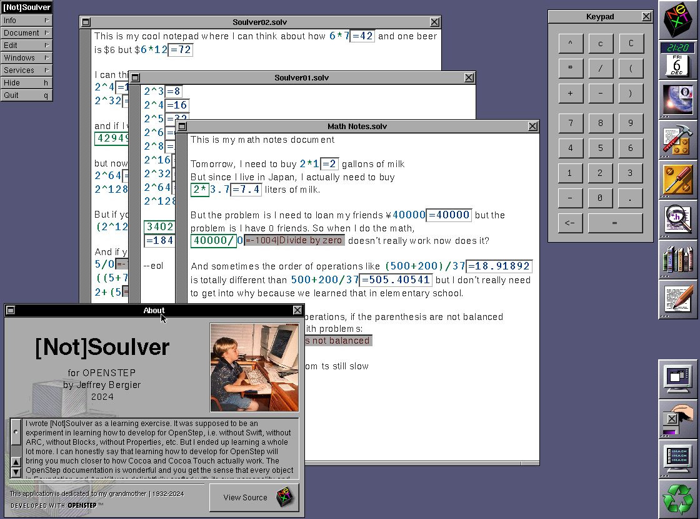

# I Made an App for NeXTSTEP or:
## How I learned to stop worrying and love Objective-C
Thank you for coming to my Try! Swift Tokyo 2025 lightning talk. While the talk was short, 
I hope it inspired your curiosity. I would love to do a longer talk on this subject, 
but lets be real, its a Swift conference, not a 30 year old Objective-C conference.

## Resources
- [Slides](LightningTalk/index.html) - Clone this repo and open `LightningTalk/index.html` 
  in your favorite browser
- [\[Not\]Soulver for OpenStep](https://github.com/jeffreybergier/NotSoulver) - Star the 
  repo to follow along with me while I upgrade this app across 20 years of OS X releases
- [Timer App](LightningTimer/LightningTimer) - Not much use but if you want to see how 
  easy it was to build this little timer app for OpenStep, take a look

## Atsuko Tsuchiya
During try! Swift Tokyo 2025, I had links to Atsuko's resume here, but for privacy reasons, 
I have removed them. However, if you are hiring junior devs or have advice for 
boot camp graduates in Japan, please contact me on [LinkedIn.](https://www.linkedin.com/in/jeffreybergier/)
- [~~Resume (English)~~](LightningTalk/docs/Tsuchiya.Atsuko.Resume.EN.pdf)
- [~~Resume (Japanese)~~](LightningTalk/docs/Tsuchiya.Atsuko.Resume.JA.pdf)

## Video
The folks at try! Swift Tokyo run an amazing show including super quick editing and
uploading of the videos. I am happy to say that, after only 1 full working day, the
video for this talk is on youtube.
- [try! Swift Tokyo 2025 - I Built an App for NeXTSTEP or:](https://youtu.be/dwpsVqsQG5s?si=lpV4nFQmyplFlbXU)
