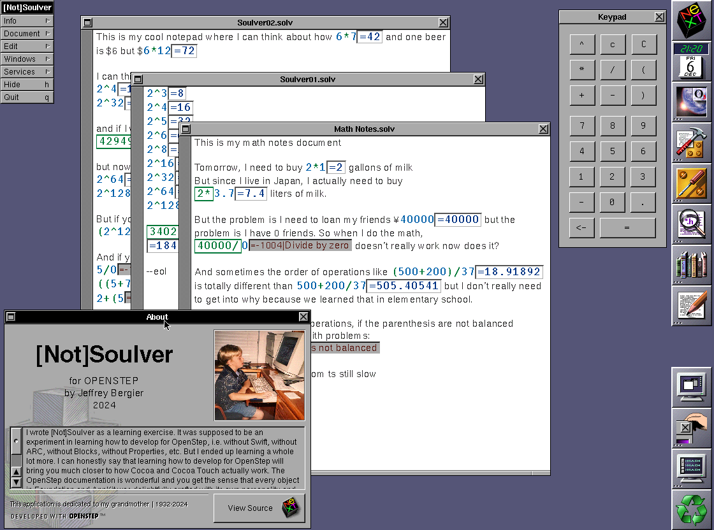

# I Made an App for NeXTSTEP,
## or how I learned to stop worrying and love Objective-C
Thank you for coming to my Try! Swift Tokyo 2025 lightning talk. While the talk was short, I hope it inspired your curiosity. I would love to do a longer talk on this subject, but lets be real, its a Swift conference, not a 30 year old Objective-C conference.

## Resources
- [Slides](LightningTalk/index.html) - Clone this repo and open `LightningTalk/index.html` in your favorite browser
- [\[Not\]Soulver for OpenStep](https://github.com/jeffreybergier/NotSoulver) - Star the repo to follow along with me while I upgrade this app across 20 years of OS X releases
- [Timer App](LightningTimer/LightningTimer) - Not much use but if you want to see how easy it was to build this little timer app for OpenStep, take a look
This is a guide for how to get a development environment working in OpenStep

## Atsuko Tsuchiya
If you can help my friend Atsuko find her first development job
- [Resume (English)](LightningTalk/docs/Tsuchiya.Atsuko.Resume.EN.pdf)
- [Resume (Japanese)](LightningTalk/docs/Tsuchiya.Atsuko.Resume.JA.pdf)

## Video
Unfortunately, there is no recording of the presentation. But I did my best to recreate the talk offline. Its not as fun, but it has all the same content.
- [Presentation Recreation Video](https://drive.google.com/file/d/1IGKVar6Rn0vYqLYuU7EaEeMTLS96P8cx/view?usp=share_link)
